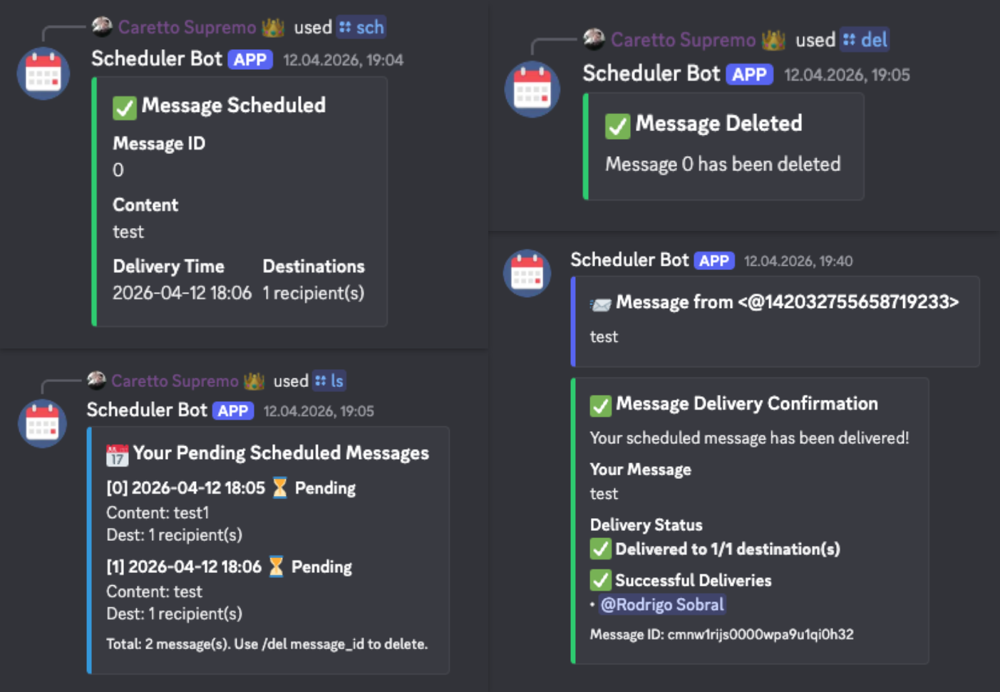

# 📅 Scheduler Discord Bot

A Discord bot that schedules messages to users and channels at specific times with delivery confirmations and message management.



## Features

- ⏰ **Schedule Messages** - Set delivery time and date for messages
- 👥 **Multiple Destinations** - Send to multiple users/channels in one message
- ✅ **Delivery Confirmations** - Get notified when messages are delivered
- 🗂️ **Message Management** - List, update, and delete pending messages
- 📊 **Reliable Queuing** - SQLite database with automatic retry on failures

## Discord Commands

| Command | Purpose |
|---------|----------|
| `/help` | Show all available commands and usage |
| `/sch` | Schedule a message (message, destinations, time, optional date) |
| `/ls` | List all pending scheduled messages |
| `/del` | Delete a pending message by queue position |
| `/mv` | Update a pending message field (content, destinations, time, date) |

## Quick Examples

```
/sch "Hello!" @user 15:30
/sch "Daily report" #general 09:00
/sch "Birthday reminder" @alice @bob 25/12 10:00
/ls
/del 0
/mv time 0 20:00
```

## Documentation

- **[DEVELOPMENT.md](assets/docs/DEVELOPMENT.md)** - How to set up and run locally
- **[DEPLOYMENT.md](assets/docs/DEPLOYMENT.md)** - How to deploy to your infrastructure

---

**License**: MIT
